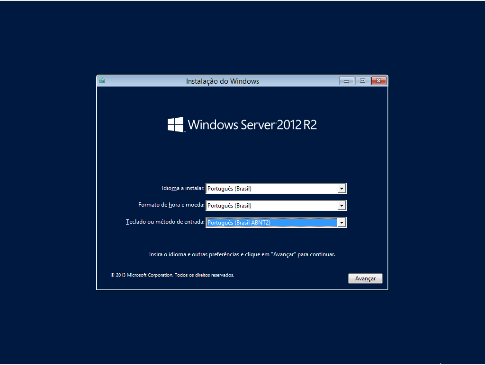

# PASSO A PASSO COMO BAIXAR O WINDOWS SERVER 2012
# PASSO 1: Selecione o Teclado/Método de Entrada em "Português (Brasil ABNT2)

 
 
# PASSO 2: Avance e clique em Instalar Agora

 
# PASSO 3: Escolha a segunda opção (Windows Server 2012 R2 Standard...)

 
# PASSO 4: Aceito os termos de licença e avance

 
# PASSO 5: Escolha o tipo de instalação personalizada

 
# PASSO 6: Clique no primeiro espaço e em seguida clique em "Novo"

 
# PASSO 7: Coloque o tamanho do espaço para 61920MB e dê um Aplicar

 
# PASSO 8: Selecione a segunda opção e avance

 
# PASSO 9: Espere a instalação ser concluída

 
# PASSO 10: Espere essa página carregar

 
# PASSO 11: Crie uma senha para o seu usuário

 
# PASSO 12: Após a criação da senha, clique em concluir e prossiga

 
# PASSO 13: Aperte Control + Alt + Delete

 
# PASSO 14: Insira sua senha e pressione a tecla Enter

 
# PASSO 15: Faça bom uso do seu windows!!
